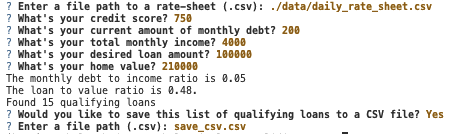

# Loan Qualifier Application with CSV File Results

This is a command-line interface (CLI) application in which end users can input their own personal data in order to be considered for a loan. The application will scan the `daily_rate_sheet.csv` CSV file in order to determine whether a user would be qualified for a lona and if so which loans. Then the application will finish with an option to create a CSV file of all the loans a user is qualified for so they may easily view and share the results.

---

## Technologies

This application was written in Python 3.9.12. This application is dependent on the [fire](https://google.github.io/python-fire/guide/) and [questionary](https://pypi.org/project/questionary/) python libraries. 

---

## Installation Guide

To install python fire via your CLI terminal:
```python
pip install fire
```

To install python questionary via your CLI terminal:
```python
pip install questionary
```

---

## Usage

When you run the app.py file,
```python
python app.py
```
you will be presented with several questions. Please input your personal answers--see an example below. The CSV file you create will be a list of the loans which you qualify for from the original list of loans, `daily_rate_sheet.csv`. 



---

## Contributors

Rachel Ann Hodson, rachelannhodson@gmail.com

---

## License

MIT
