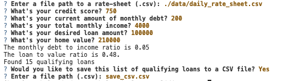

# Loan Qualifier Application with CSV File Results

This is a command-line interface (CLI) application in which loan officers can upload their `.csv` files in order to filter loans a client qualifies for based on their given data. Then the application will finish with an option to create a `.csv` file of all the loans a client is qualified for so they may easily view and share the results.

---

## Technologies

This application was written in Python 3.9.12. This application is dependent on the following libraries:
* [sys](https://docs.python.org/3/library/sys.html)
* [fire](https://google.github.io/python-fire/guide/)
* [questionary](https://pypi.org/project/questionary/)
* [pathlib](https://docs.python.org/3/library/pathlib.html)
* [csv](https://docs.python.org/3/library/csv.html)

---

## Installation Guide

If you need to install any of these libraries onto your local machine you can type these into the terminal:
```python
pip install os-sys
pip install fire
pip install questionary
pip install pathlib
pip install python-csv
```

---

## Usage

When you run the `loan_app_qualifier.py` file, you will be presented with several questions. Please input your client's answers, you can see an example below. The `.csv` file you create will be a list of the loans which your client qualifies for from the original list of loans, from your `.csv` file. 



---

## Contributors

[Rachel Ann Hodson](https://www.linkedin.com/in/rachelannhodson/), rachelannhodson@gmail.com

---

## License

MIT
